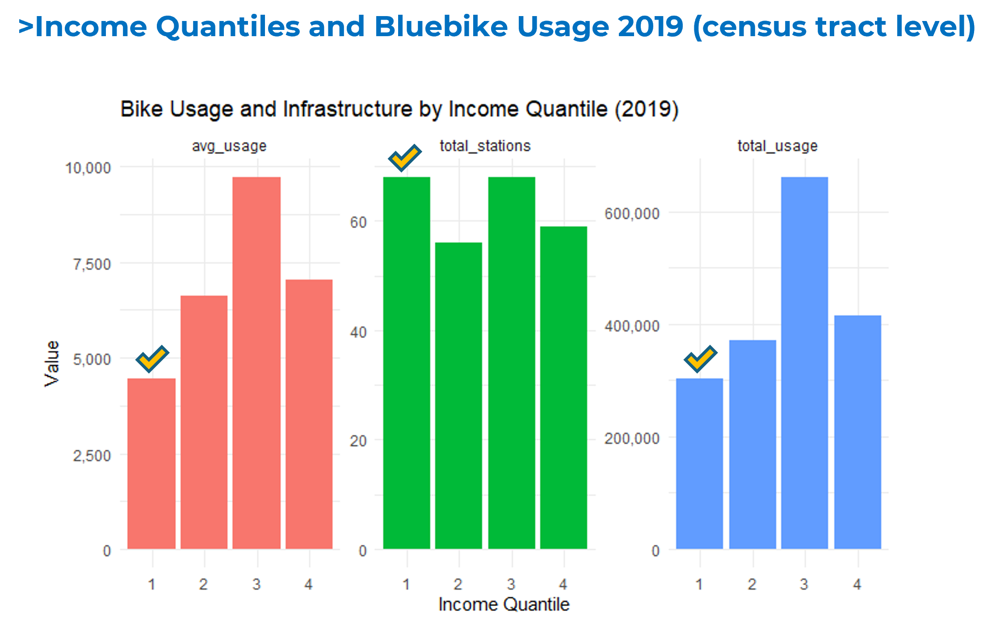

  <a href="../../">Home</a>
  <a href="../city-exploration/">City Exploration</a>
  <a href="../bikeshare-equity/">Bikeshare Equity</a>
  <a href="../homelessness/">Homelessness</a>
  <a href="../climate-gentrification/">Climate Gentrification</a>

🚴 Bikeshare Equity Analysis – Boston

<h1 class="project-main-title">Is Bikeshare Really Equally Accessible and Affordable to Everyone in Boston?</h1>

## Key Takeaways

- **Income-based disparities in bikeshare access and usage persisted despite overall growth**
- Infrastructure expansion (250+ new stations) played a major role in increasing usage
- Affordability programs alone may not be sufficient to ensure equitable access

---

## Problem / Research Question

Intrigued by the possibility that bikeshare programs could become more accessible to low-income users, I explored Boston’s Bluebike system further. I found that the City of Boston has already taken steps to improve access by offering discounted memberships to individuals eligible for public benefit programs.

In January 2018, Boston’s Bluebikes launched a low-income membership initiative called “SNAP Card to Ride,” which provides discounted memberships to Supplemental Nutrition Assistance Program (SNAP) recipients living in Greater Boston.

This teaching case explores the demographic and socioeconomic characteristics of Bluebike usage before and after the launch of this program, focusing on the years 2015 and 2019. These years were selected to align with the ACS release periods and the corresponding Housing + Transportation (H+T) Index datasets.

---

## Data & Methods

The analysis draws on multiple datasets to examine changes in bikeshare access before and after the implementation of Boston’s low-income membership program.

- **Data sources:**  
  Bluebike trip data (2015, 2019), American Community Survey (ACS), and the Housing + Transportation (H+T) Index  

- **Approach:**  
  Census tract-level analysis of station distribution and bikeshare usage by income quantile  

- **Methods:**  
  Regression analysis (R) and GIS spatial analysis  

---

## Key Findings

### Median income, station count, and bike usage comparison (2015–2019)

  
  

    Comparison of median income, station count, and bike usage across Boston census tracts in 2015 and 2019 (Author’s analysis)
  

### Bike usage and station distribution by income quantile (2019)

  
  

    Bike usage and station distribution by income quantile in 2019, showing increased access but persistent disparities in usage (Author’s analysis)
  

The absolute number of bikeshare users in low-income census tracts increased significantly during this period.

Infrastructure expansion also played a critical role during the same period. The addition of over 250 new stations between 2015 and 2019 likely contributed to improved access across neighborhoods, particularly in areas that were previously underserved.

However, **income-based disparities in access and usage persisted**, highlighting the continued need to address structural barriers.

Although stronger statistical associations between low-income status and bikeshare usage were expected, the findings reflect the short-term and exploratory nature of this analysis.

---

## Policy Implications

While this analysis was initially motivated by the City of Boston’s launch of a discounted bikeshare membership in 2018, the results offer only indirect evidence of its impact.

Increases in bikeshare usage among low-income and racially diverse communities may suggest positive trends in access and inclusion, yet the relationship remains complex and not uniformly significant across all measures.

Through this process, it also became evident that infrastructure expansion played a critical role during the same period.

This suggests that physical proximity and network density may be as influential as affordability in driving usage.

Nevertheless, the data clearly reflect a city-wide effort to expand bikeshare availability and reduce financial barriers to entry.

This short-term analysis provides a valuable foundation for future evaluations aimed at understanding the long-term effectiveness and equity outcomes of bikeshare initiatives in Boston and beyond.

## Files & Links
- 📄 [Data Analysis Document (PDF)](bikeshare-equity.pdf)
- 📄 [Summary Document (PDF)](Summary_Seungyeon_Kim.pdf)
