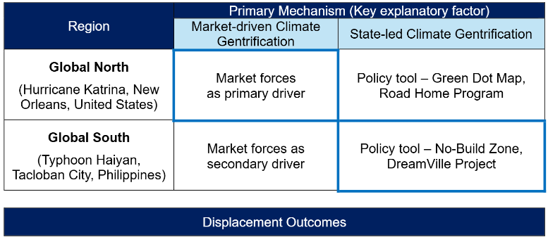

  <a href="../../">Home</a>
  <a href="../city-exploration/">City Exploration</a>
  <a href="../bikeshare-equity/">Bikeshare Equity</a>
  <a href="../homelessness/">Homelessness</a>
  <a href="../climate-gentrification/">Climate Gentrification</a>

🌍 Climate Gentrification

<h1 class="project-main-title">
Climate Gentrification: Similar yet Different
</h1>

---

## Problem / Research Question

Although studies on climate gentrification remain limited, particularly comparative analyses examining differences between the Global North and South, this study explores multiple theoretical perspectives to contextualize gentrification within regional settings. It examines case studies from both regions to better understand how climate gentrification has unfolded following major natural disasters: Hurricane Katrina in New Orleans, United States (Global North case), and Typhoon Haiyan in Tacloban City, Philippines (Global South case).

By situating these cases within their respective regional contexts, this study analyzes the processes of climate gentrification, state and market actors, and the differential outcomes experienced by populations across socioeconomic groups. In conclusion, the essay presents key insights comparing distinct mechanisms and outcomes of climate gentrification in the Global North and South.

---

## Data & Methods

- Literature review of urban theories on gentrification and spatial justice  
- Comparative case study analysis  
- Examination of state- vs. market-driven mechanisms  

---

## Key Findings

  
  

    Comparison of market-driven and state-led mechanisms shaping climate gentrification across regions (Author’s analysis)
  

Climate gentrification produces similar displacement outcomes across regions, but operates through fundamentally different mechanisms.

Climate disasters play distinct roles in the Global North and Global South. In New
Orleans, climate risk functioned primarily as a trigger that accelerated existing
patterns of gentrification, whereas in Tacloban City it operated as a justification for
forced eviction and relocation framed as climate adaptation.

In the Global North, climate-related gentrification is primarily driven by **market-based processes**, with the state playing a largely supportive or indirect role.

In contrast, in the Global South, **state-led spatial governance** operates as the primary driver of climate gentrification, particularly in contexts shaped by tenure diversity and postcolonial development goals.

In both cases, climate gentrification results in the exclusion of historically
marginalized populations (Black communities, informal settlers, and low-income
groups), alongside the influx of higher socioeconomic groups (White populations,
formal tenure holders, and higher-income residents).

---

## Policy Implications

Based on the case studies, this paper demonstrates that climate gentrification aligns with broader gentrification theories, while operating through regionally distinct mechanisms. In the Global North, climate-conditioned gentrification is best explained through traditional market-driven processes rooted in capitalist urban development, with the state playing a largely supportive or indirect role. In contrast, in the Global South, state-led intervention operates as the primary driver of climate gentrification, particularly within contexts characterized by tenure diversity and postcolonial aspirations to become “world-class” cities.

Across both cases, climate gentrification reflects a hybrid interaction between state and market actors that disproportionately displaces populations with the least political and economic power, albeit through different dominant pathways. While the literature on climate gentrification has thus far accumulated empirical evidence largely from Western contexts, this study highlights the need for further research in the Global South, where climate risk is more explicitly mobilized as a political and territorial tool.

Future research could expand this comparative framework to include more granular regional contexts, such as East Asia, Latin America and the Caribbean, Europe, and Africa. Additionally, beyond sudden-onset disasters, examining slow-onset climate processes would deepen understanding of how climate gentrification unfolds across diverse environmental and institutional settings.

---

## Files & Links

- [Download Full Paper](climate-gentrification.pdf)
